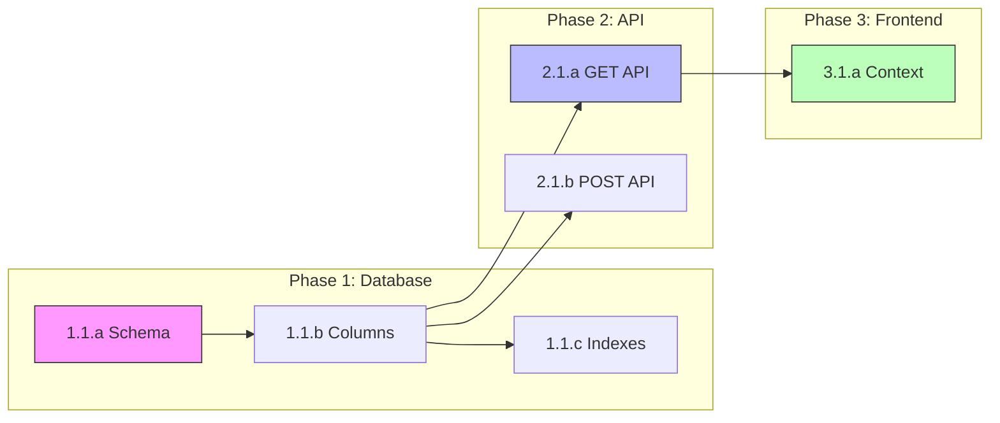

# Task Planning Standards

**When to Read:** Multi-phase implementations, complex feature builds, migration planning, or any
task requiring phased execution with multiple steps.

---

## Task ID System (MANDATORY for Complex Tasks)

When creating implementation plans, to-do lists, or phased work, **ALWAYS use hierarchical task IDs
** instead of plain checkboxes.

### Task ID Format

```
{Phase}.{Section}.{Task Letter} - {Task Description}
```

**Examples:**

- `1.1.a` - Create migration SQL file
- `1.1.b` - Add indexes to table
- `2.3.c` - Update API endpoint

### ID Structure Rules

| Level       | Format                    | Purpose                    |
|-------------|---------------------------|----------------------------|
| **Phase**   | `1.`, `2.`, `3.`          | Major implementation phase |
| **Section** | `1.1`, `1.2`, `2.1`       | Group within phase         |
| **Task**    | `1.1.a`, `1.1.b`, `1.2.a` | Individual actionable item |

### Example: Correct Task List Format

```markdown
### Phase 1: Database Schema Updates

#### 1.1 Extend `accounts_vehicles` Table

- [ ] **1.1.a** - Create migration SQL file
- [ ] **1.1.b** - Add `id`, `nickname`, `is_default` columns
- [ ] **1.1.c** - Add indexes for common queries
- [ ] **1.1.d** - Test migration on dev database
- [ ] **1.1.e** - Document rollback procedure

#### 1.2 Add `vehicle_id` to Reviews Table

- [ ] **1.2.a** - Create migration SQL file
- [ ] **1.2.b** - Add `vehicle_id` column (nullable INT)
- [ ] **1.2.c** - Add index on `vehicle_id`

### Phase 2: API Endpoints

#### 2.1 Update GET `/api/accounts/vehicles`

- [ ] **2.1.a** - Extend query to JOIN vehicle_info tables
- [ ] **2.1.b** - Return full vehicle details
- [ ] **2.1.c** - Add `max_vehicles` limit to response
```

### Why Task IDs Matter

1. **Trackability** - Easily reference specific tasks in conversations ("Let's revisit 2.1.b")
2. **Dependencies** - Clear references for dependency graphs ("2.1.a depends on 1.1.d")
3. **Progress Tracking** - Precise status updates ("Completed 1.1.a through 1.1.c")
4. **Parallel Work** - Identify which tasks can run concurrently

---

## Dependency Graphs (REQUIRED for Multi-Phase Work)

For any implementation plan with **2+ phases** or **complex integrations**, include a dependency
graph showing:

- What tasks block other tasks
- What can run in parallel
- Critical path items

### When to Create Dependency Graphs

| Scenario                                 | Dependency Graph Required? |
|------------------------------------------|----------------------------|
| Single-phase, 3-5 tasks                  | No                         |
| Multi-phase implementation               | **YES**                    |
| Database migrations with code changes    | **YES**                    |
| Feature touching frontend + backend + DB | **YES**                    |
| API changes affecting multiple consumers | **YES**                    |
| Simple bug fix                           | No                         |
| Documentation update                     | No                         |

### Dependency Graph Formats

#### Option 1: ASCII Diagram (Preferred for Markdown)

```
DEPENDENCY GRAPH
================

Phase 1 (Database)          Phase 2 (API)              Phase 3 (Frontend)
─────────────────           ────────────               ─────────────────

┌─────────┐
│  1.1.a  │──────────────────────────────────────────────────────┐
│ Schema  │                                                       │
└────┬────┘                                                       │
     │                                                            │
     ▼                                                            ▼
┌─────────┐                 ┌─────────┐                 ┌─────────┐
│  1.1.b  │────────────────►│  2.1.a  │────────────────►│  3.1.a  │
│ Columns │                 │ GET API │                 │ Context │
└────┬────┘                 └────┬────┘                 └─────────┘
     │                           │
     │    ┌──────────────────────┘
     │    │
     ▼    ▼
┌─────────┐                 ┌─────────┐
│  1.1.c  │ (parallel)      │  2.1.b  │
│ Indexes │                 │ POST API│
└─────────┘                 └─────────┘

LEGEND:
───► Sequential dependency (must complete before next)
─ ─► Soft dependency (recommended but not blocking)
(parallel) Can run simultaneously with adjacent tasks
```

#### Option 2: Mermaid Diagram (For GitHub Rendering)



#### Option 3: Table Format (Simple Dependencies)

```markdown
### Dependency Matrix

| Task | Depends On | Blocks | Can Parallel With |
|------|------------|--------|-------------------|
| 1.1.a | None | 1.1.b, 1.1.c | - |
| 1.1.b | 1.1.a | 2.1.a, 2.1.b | 1.1.c |
| 1.1.c | 1.1.a | None | 1.1.b |
| 2.1.a | 1.1.b | 3.1.a | 2.1.b |
| 2.1.b | 1.1.b | 3.1.b | 2.1.a |
| 3.1.a | 2.1.a | None | 3.1.b |
```

### Critical Path Identification

Always identify and highlight the **critical path** - the longest chain of dependent tasks:

```markdown
### Critical Path

**1.1.a → 1.1.b → 2.1.a → 3.1.a → 3.2.a**

This is the minimum sequence of tasks that must complete sequentially.
All other tasks can be parallelized around this path.
```

---

## Parallel Work Opportunities

Explicitly call out parallelization opportunities:

```markdown
### Parallel Execution Opportunities

**After 1.1.b completes:**
- [ ] **2.1.a** and **2.1.b** can run in parallel (different API endpoints)
- [ ] **2.2.a** can start (doesn't depend on 2.1.x)

**After Phase 1 completes:**
- Spawn Agent A for Phase 2 API work
- Spawn Agent B for Phase 2 database helpers
- Both can work simultaneously

**Blocking Points:**
- **3.1.a** CANNOT start until **2.1.a** is complete and tested
- **Deploy** CANNOT happen until all Phase 3 tasks pass E2E tests
```

---

## Phase Boundary Validation

Before starting a new phase, document what must be true:

```markdown
### Phase 2 Entry Criteria

Before starting Phase 2 (API), confirm:

| Criteria | Verification Method |
|----------|---------------------|
| All 1.x tasks complete | All checkboxes marked [x] |
| Migrations run successfully | `node scripts/verify-migration.js` passes |
| No regression in existing tests | `npm test` all green |
| Schema matches expected | Compare with documented schema |
```

---

## Integration with TodoWrite Tool

When using the TodoWrite tool for task tracking, include task IDs in the content:

```javascript
// GOOD - Task IDs included
{
  "content": "[1.1.a] Create migration SQL file",
  "status": "in_progress",
  "activeForm": "Creating migration SQL file (1.1.a)"
}

// BAD - No task ID
{
  "content": "Create migration SQL file",
  "status": "in_progress",
  "activeForm": "Creating migration SQL file"
}
```

---

## Quick Reference

### Checklist Before Finalizing Any Implementation Plan

- [ ] All tasks have unique IDs (X.Y.z format)
- [ ] Dependency graph included (for multi-phase work)
- [ ] Critical path identified
- [ ] Parallel opportunities documented
- [ ] Phase entry/exit criteria defined
- [ ] Blocking dependencies clearly marked
- [ ] Rollback points identified

---

*Version: 1.0*
*Last Updated: 2026-01-11*
